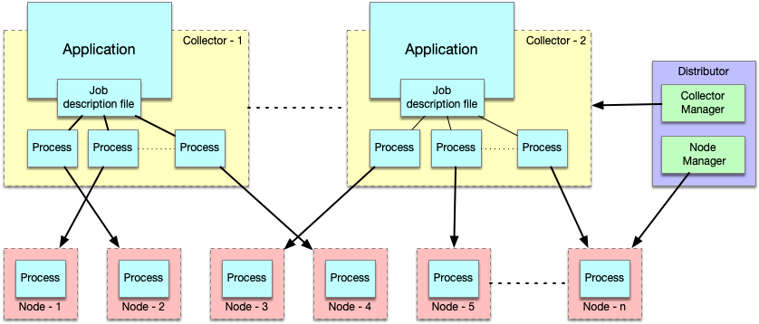
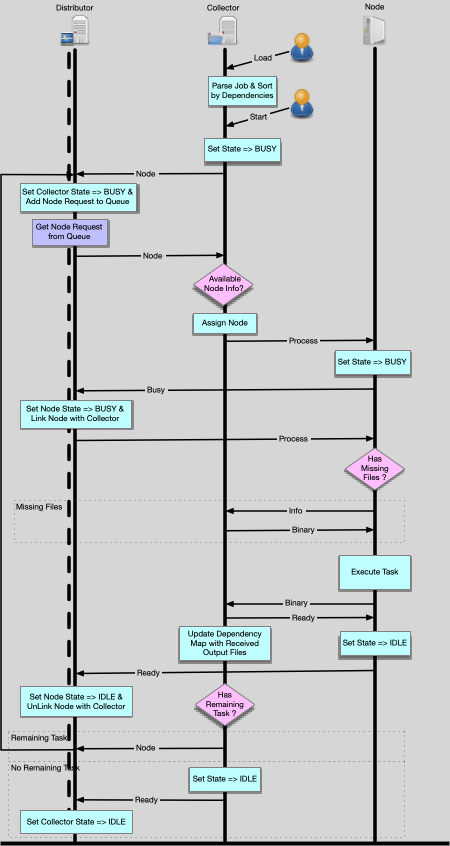
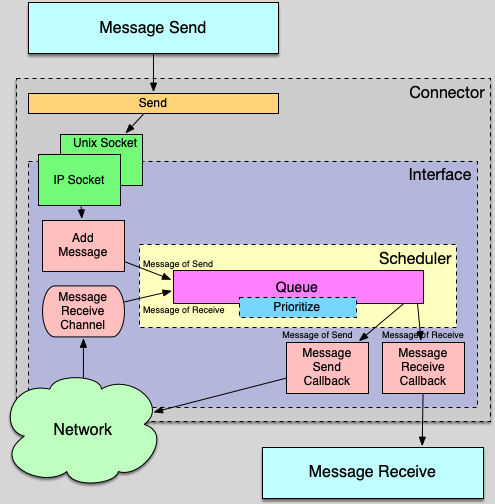
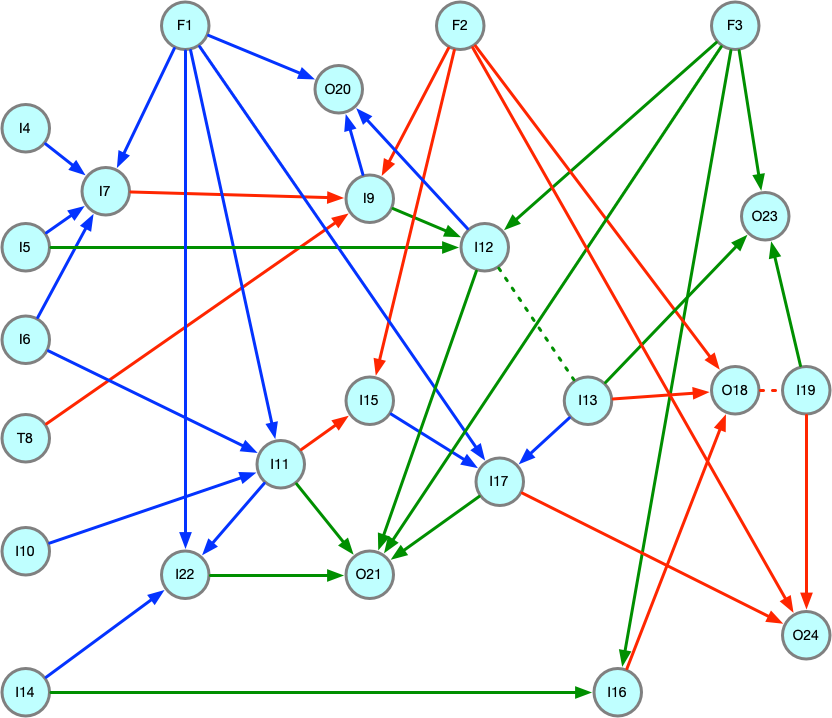
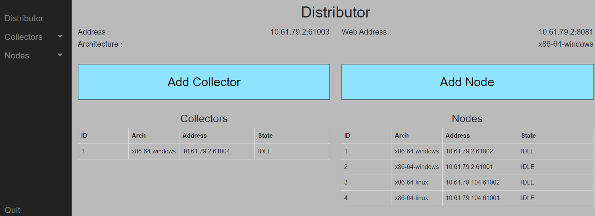
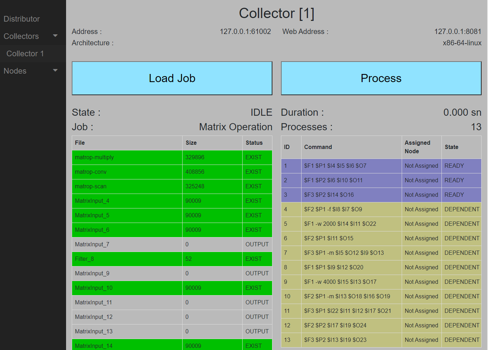
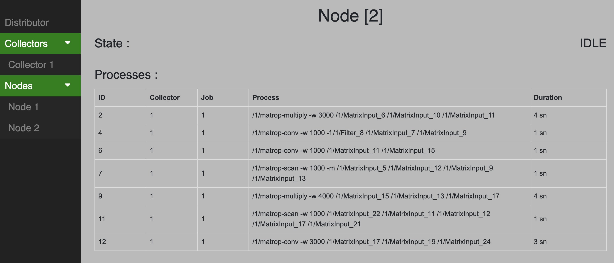

# Dicon - An HPC architecture for embedded systems

The goal of this architecture is to divide a large-scale application into small chunks of work that are executed on embedded computers. The advantage of the system is that the increased number of computers that constitute the system helps distribute the risks associated with system sustainability across a larger number of sub-systems, improving the overall system reliability, performance and efficiency.

The architecture is designed as part of a master thesis for academical purposes, however it is applicable for any kind of distributed task driven projects using low cost embedded devices.

Development cycle has still open points and needs substantial improvements to cover all corner cases, So all contributions and suggestions in architectural design and help in development are welcome :)

### Quick Overview

Architecture's main operation is based on collecting a target large-scale applications subtasks (processes) and distribute them to available embedded computers to be processed. In order to achieve that, first the application itself should be analyzed and divide into processes. At this point a rule based structure is needed to make the architecture transparent to the target application. In this way application creator is the main responsable for defining the rules and decompose the target application to subtasks. Analyze process step includes dependency tracking functionality based on **Kahn's** algorithm and it creates dependency map of the rules that depends each other.

The architecture consist of three main modules; **Distributor, Collector(s), Node(s)**

- **Distributor** Keeps track of the collectors and nodes lifecycles and their availability. However it does not involve in any act related to the process going between collectors and nodes.

- **Collectors** Analyze the applications and their subtasks based on their predefined rule files which defines the subtask process details. Then it transfers the subtasks to available nodes to be executed.

- **Nodes** Runs the application subtasks that comes from collectors as defined in their rule files.



### Requirements

System can build on **Linux**, **macOS** and **Windows (via WSL 2)** operating systems using **gcc**, **clang** vs toolchains to produce application executables. CMake and GNU make is used as compile platform which have wide range of usage.

[**Civetweb**](https://github.com/civetweb/civetweb) library is selected for  application's UI. Its main advantage is to serve the UI in a web page, which allows to access the UI even from embedded devices. It provide cross-platform support and written in C++ to have high response and wide range support.

[**Json-c**](https://github.com/json-c/json-c) library is selected for json-parsing, used as job description interface.

### Getting Started 

The architecture source code is bundled with the UI code, which will be seperated in the future. But for now, it simplifies the whole compile process in one step. 

Compile process is carried out with **CMake** build system and **gcc** or **clang** toolchains.

#### Install Prerequisities

On **MacOS** Platform;

if not installed already, install **HomeBrew** package system

```
	ruby -e "$(curl -fsSL https://raw.githubusercontent.com/Homebrew/install/master/install)"
```

Install build utilities

```
	brew install cmake
	brew install g++
```

Install dependencies

```
	brew install json-c
```

On **Linux** and **Windows (WSL 2)** Platform;

Install build utilities

```
	apt install build-essential
	apt install cmake
```

Install dependencies

```
	apt install json-c
```

#### Build Process

To cross-compile for linux based nodes; get sysroot enabled toolchains; ***arm-linux-gnueabihf***, ***x86-linux-gnueabihf*** and put them under ***/usr/local/toolchains*** or update the **TOOLCHAIN_DIR** variable in the corresponding toolchain cmake files.

Create build directory

```
	mkdir build
	cd build
```

- for target ==> MacOS, Linux, Windows

```
	cmake ..
	cmake --build .
```

- for target ==> ARM based Linux

```
	cmake .. -DCMAKE_TOOLCHAIN_FILE=../toolchain-linux-arm.cmake
	cmake --build . --target dicon
```

- for target ==> x86 based Linux

```
	cmake .. -DCMAKE_TOOLCHAIN_FILE=../toolchain-linux-x86.cmake
	cmake --build . --target dicon
```

#### Locating Job Files

Application gets the target job files as a single compressed zip file through Web UI and extracts on the server. As soon as operator triggers the process command via Collector, system parse the job file and starts the distributed execution process across the node devices.

#### Workflow

The workflow of the whole process starts at computers running collectors and finishes at the nodes depicted as follows;

1. Users define the tasks of an application and trigger the whole process through collector UI.
5. Collector sets its state to BUSY, picks ready task list that does not have any dependencies from the loaded job and sends a **Node** message to distributor to request available nodes.
6. Distributor gets the **Node** message from the collector, sets its state BUSY and add its request to pool.
4. Separate thread process the queue for waiting requests, if a waiting request exists, sends a **Node** message to Collector with the requested amount of node information.
5. Collector gets the **Node** message from distributor, if there is no available node then it continue to wait in message waiting state. If there is, then it assign available nodes to the independent tasks and sends these to the nodes with **Process** message
6. Node gets the **Process** message, sets its state to BUSY and sends a **Busy** message to distributor to inform the distributor about its state. 
7. Distributor gets the **Busy** message from node, set its state to BUSY, link it with the assigned collector and sends **Process** message to node to start the process.
8. Node gets the **Process** message from distributor, parse the task information and extracts all dependencies. If dependencies includes files then it searches for these files in its file system. If any of them is not found, it sends a **Info** message to collector to request these missing files, if all required files are exists then it continues with step **11**.
9. Collector gets the **Info** message and it sends the requested files back to node with **Binary** message.
10. Node gets the **Binary** message, and place the files to the appropriate directories as depicted in the process information. 
11. Node executes the process executable via shell of the host OS and wait its finish. Then it sends the generated output files to collector with **Binary** message.
12. Collector gets the **Binary**  message and sends back **Ready** message to Node.
13. Node makes its state back to IDLE and sends **Ready** message to distributor.
14. Distributor gets **Ready** message from node, set its state to IDLE and unlink its connection with the assigned collector.
15. Meanwhile, collector updates the job dependencies and retrigger the whole cycle with the remaining tasks from step **2**
16. If there is no waiting task exists, collector sets its state to IDLE, and sends **Ready** message to distributor.
17. Distributor gets **Ready** message from collector and sets its state to IDLE.



#### Communication Interface

The communication interface is structured based on sockets and it includes messaging related common tasks which are summarized as;

- Creates the messaging channels seperate for send and receive.
- Creates a queue mechanism to hold and sort all send/receive messages to be executed based on their priorities.
- Setups all message execution callbacks
- Finalize the messaging mechanism
- Creates the notification related tasks


#### Message Transfer Flow



### Jobs

The tasks of the applications that are going to execute in nodes are defined in job files.  In Job directories all the task specific files and job files are located in their predefined locations. JSON file format is choosed to define the whole structure of job file. Basic operation can be simplied as; the user initiates the execution process through user interface of collector, then collector loads the **"Job.json"** file resides in the application folder which is selected through user interface.

Job files includes all of the dependencies and process details of the tasks in order to execute properly.

There are four types of contents that can be defined in job files;

- **Name Content** It contains the name of the job;

- **File Content** It includes the file name information that are going to be used by process in the nodes.  It defines with **files** tag in the json file. 

- **Parameter Content** It includes the parameter sets that are going to pass to executable files; It defines with **parameters** tag in the json file.

- **Process Content** It contains the command sequence of the executable list that is going to be run in nodes. Basically it is defined as macro which has references to file and parameter contents.  It defines with **processes** tag in the json file. 

	The definition of the macro items are;
	
	- **"$"** : Start of the macro
	- **"F/I"** : Reference to the file list in the rule file
	- **"P"** : Reference to the parameter list in the rule file
	- **"INDEX"** : Index of the corresponding list

In order to demonstrate the application running properly, sample job is created based on matrix operations; multiply, scan and convolution. Hypothetical dependencies are created between tasks to show the application is sorts the processes and warns if any dependency loop is exists between tasks. Sample dependency map is as follows;



Corresponding job description file provided with the project is as follows;

    "Job": {
    
        "name": "Matrix Operation",
    
        "files": [
        "matrop-multiply",
        "matrop-conv",
        "matrop-scan",
        "MatrixInput_4",
        "MatrixInput_5",
        "MatrixInput_6",
        "MatrixInput_7",
        "Filter_8",
        "MatrixInput_9",
        "MatrixInput_10",
        "MatrixInput_11",
        "MatrixInput_12",
        "MatrixInput_13",
        "MatrixInput_14",
        "MatrixInput_15",
        "MatrixInput_16",
        "MatrixInput_17",
        "MatrixInput_18",
        "MatrixInput_19",
        "MatrixInput_20",
        "MatrixInput_21",
        "MatrixInput_22",
        "MatrixInput_23",
        "MatrixInput_24"
        ],
    
        "parameters": [
        "-w 1000",
        "-w 3000"
        ],
    
        "processes": [
        "$F1 $P1 $I4 $I5 $I6 $O7",
        "$F1 -w 2000 $I14 $I11 $O22",
        "$F1 $P2 $I6 $I10 $O11",
        "$F1 -w 4000 $I15 $I13 $O17",
        "$F1 $P1 $I9 $I12 $O20",
        "$F2 $P1 -f $I8 $I7 $O9",
        "$F2 $P1 $I11 $O15",
        "$F2 $P2 $I17 $I19 $O24",
        "$F2 $P1 -m $I13 $O18 $I16 $O19",
        "$F3 $P1 -m $I5 $O12 $I9 $O13",
        "$F3 $P1 $I22 $I11 $I12 $I17 $O21",
        "$F3 $P2 $I14 $O16",
        "$F3 $P2 $I13 $I19 $O23"
        ]
     }


In this sample the node executes the following processes at one of their assignment. 

```sh
$ matrop-multiply -w 1000 MatrixInput_4 MatrixInput_5 MatrixInput_6 MatrixInput_7
$ matrop-conv -w 1000 -f Filter_8 MatrixInput_7 MatrixInput_9
$ matrop-scan -w 1000 -m MatrixInput_5 MatrixInput_12 MatrixInput_9 MatrixInput_13
```

### User Interface

There are two different types of user interface is designed to test the architecture. First one is based on **civetweb** library which is a platform independent C++ based web UI library, the second is works interactively through terminal.

To test the whole architecture, all distributor, collectors and nodes should be initialized. If they are going to test with single UI, then all the initialize actions should be triggered in all tabs. Address bind operation is based on the availability of the ethernet NICs and unix sockets. If there is limited number of NIC is available then differentiation is handled with selecting different port numbers automatically.

After the application is initialized it opens web interface through **8081** port, then operator can trig the polling command with **Poll** button through distributor UI. Whenever a collector or node returns alive messages, a dedicated tab created for them on the left side of the screen.



On Collector side, if it connects to a distributor, it allows users to run their jobs via its UI. First the operator selects the job in compressed zip format and uploads it top the selected collector machine. At this point operator can see the detailed job information through UI. Then it starts the execution process with using **Process** button.



Finally on Node side, after the initialization is done, node get interacts with Collectors requests to run the processes through shell and lists them on the UI.



### Open Issues

- Project is in still early development stage therefore lots of corner cases and scenarios should be tested.
- Demo application is developed just for testing the architecture purpose and can only be used as a reference; it is not suitable to be used in a final product.

### Contributing

You are welcome to contribute to this project in all manner, involving in the development, making suggestions, notifying of wrong or missing design related parts or testing.

### License

Project is licensed under [GNU Affero General Public License v3.0](LICENSE)
