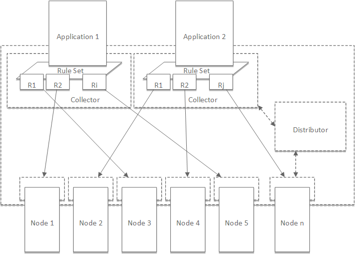
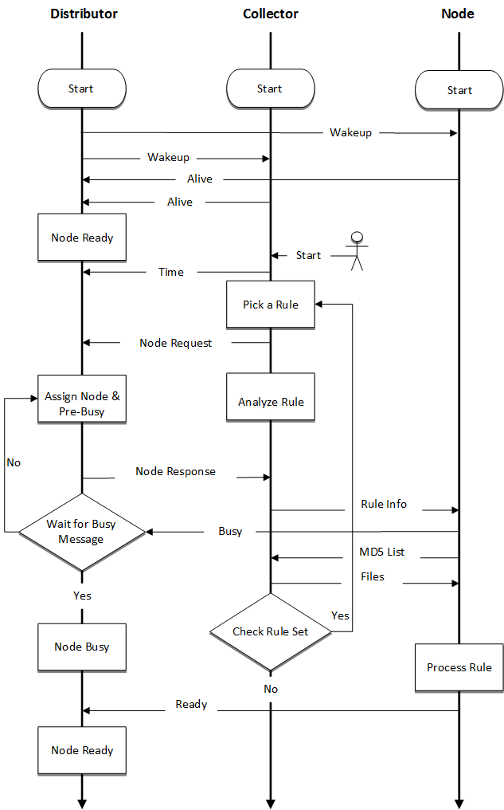
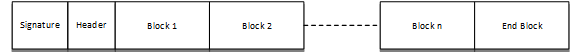
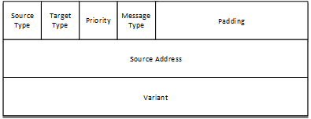
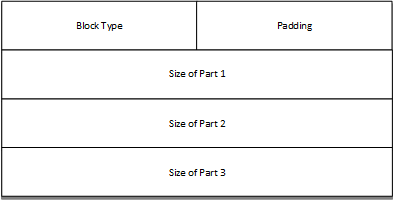
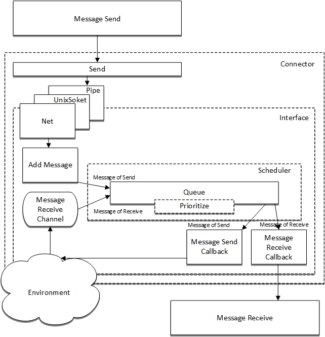
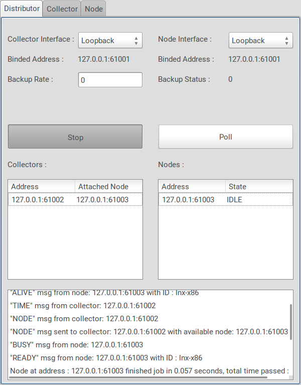
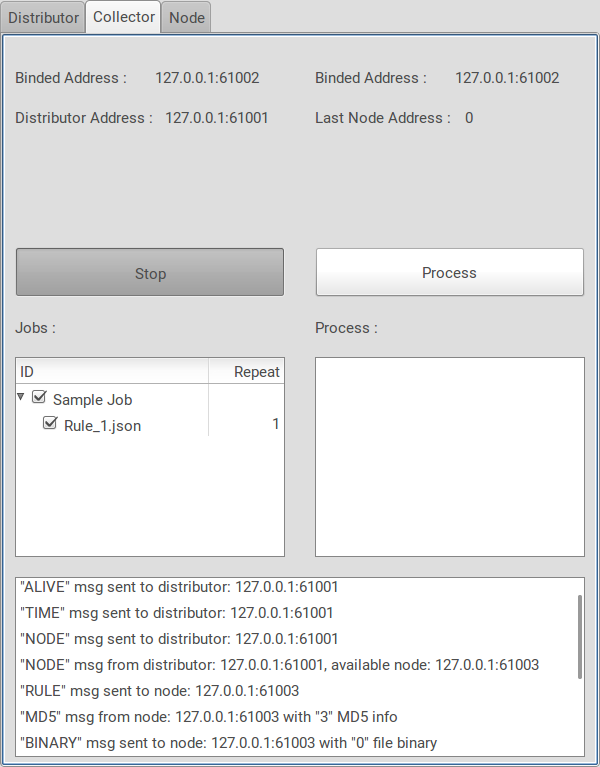
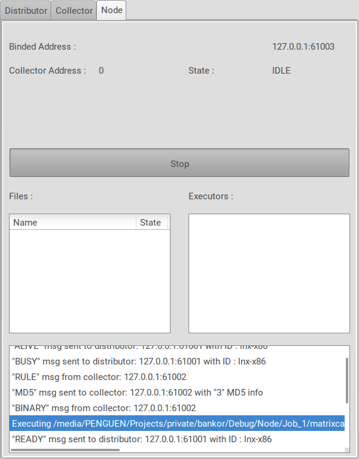

# Bankor - A distributed architecture for embedded systems

The goal of this architecture is to divide a large-scale application into small chunks of work that are executed on embedded computers. The advantage of the system is that the increased number of computers that constitute the system helps distribute the risks associated with system sustainability across a larger number of sub-systems, improving the overall system reliability and efficiency.

Typically the architecture is somewhat a variant of cluster systems, however it has additional features;

- **Platform flexibility** Nodes can be addressed with their processor architecture, this way subtasks can be addressed to specific nodes depends on their architecture specific work type.

- **Reliability** All nodes are kept in a pool with a predefined backup ratio, in which some nodes are preoccupied for backup purposes in case of failures.

- **Efficiency** System efficiency is increased by 
	- optimizing file transfers by avoiding redundant transfers via MD5 based controls, 
	- using a scoring algorithm designed as part of this work to prioritize the nodes providing a mechanism to assign priority scores to 	subtasks to be executed at nodes, 
	- homogenizing use among all nodes to equalize weathering rates and delay the first breakdown.

The architecture is designed as part of a master thesis for academical purposes, however it is considered appreciate for any kind of distributed projects using low cost embedded devices.

Development cycle has still open points and needs substantial improvements to cover all corner cases, So all contributions and suggestions in architectural design and help in development are welcome :)

### Quick Overview

Architecture's main operation is based on collecting a target large-scale applications subtasks and distribute them to available embedded computers to be processed. In order to achieve that, first the application itself should be analyzed and divide into subtasks. At this point a kind of rule based structure is needed to make the architecture transparent to the target application. In this way application creator is the main responsable for defining the rules and decompose the target application to subtasks. 

The architecture consist of three main modules; **Distributor, Collector(s), Node(s)**

- **Distributor** Keeps track of the collectors and nodes lifecycles and their availability. However it does not involve in any act related to the process going between collectors and nodes.

- **Collectors** Analyse the applications and their subtasks based on their predefined rule files which defines the subtask process details. Then it transfers the subtasks to available nodes to be executed.

- **Nodes** Runs the application subtasks that comes from collectors as defined in their rule files.



### Requirements

Platform independent development cycle is strongly selected as one of the main achievements of this system, so all Windows, Linux and macOS operating systems and **gcc**, **clang** vs toolchains can be selected to produce architecture executables. CMake and GNU make is used as compile platform which have wide range of usage.

[WxWidgets](https://www.wxwidgets.org/) library is selected for demo application's UI. Its main advantage is to provide cross-platform support and written in C++ to have high response and wide range support.

### Getting Started 

The architecture source code is bundled with the UI code, which will be seperated in the future. But for now, it simplifies the whole compile process in one step. 

#### Compilation

The compile process can be divided into two parts; 

- **Native** : If the compilation aims for all components (Distributor, Collector and Node) running in desktop computers then Cmake based compile platform is used.

Basically first it is needed to precompile for makefile generation with cmake tool. Then standard Make compile can be processed.

```
~/bankor $ mkdir build
~/bankor $ cd build
~/bankor/build $ cmake ..
~/bankor/build $ make
```

- **CrossCompile** : If the compilation aims for nodes running on Linux based embedded computers then external toolchain (currently only arm supported) and GNU make based compile platform is used. Toolchain path should be updated in Makefile with **TOOLCHAIN_PATH** definition. It is also possible to compile the whole project with UI only using GNU make. It is only needed to define the target platform through parameter

```
~/bankor $ make pi 			#Raspberry pi v1
~/bankor $ make c15			#Arm Cortex A15 optimized compilation
~/bankor $ make c9			#Arm Cortex A9 optimized compilation
~/bankor $ make c8			#Arm Cortex A8 optimized compilation
~/bankor $ make c7			#Arm Cortex A7 optimized compilation
~/bankor $ make arm			#Generic Arm compilation
~/bankor $ make cmd			#Console based compilation for x86_64
~/bankor $ make ui			#UI based compilation for x86_64 on macOS OS
~/bankor $ make uilnx		#UI based compilation for x86_64 on Linux OS
```

#### Locating Target Files

Demo Application is in alpha stage therefore most of the target application file locations are prefixed (will be changed in the future :)) Currently all target files are located in directories based on their components; ie Collectors read the target files from Collector/Job_X directories and Nodes creates the files to be processed under the Node directory.

### Workflow

The workflow of the whole process starts at computers running collectors and finishes at the nodes depicted as follows; 

1. Distributor sends **Wakeup** broadcast to the network, and keeps it on with specific intervals to dynamically add and remove nodes from the system.

2. All the nodes and collectors get wakeup message, response to distributor with **Alive** messages.

3. Distributor marks the all nodes that get response as **Available**. If it does not get a response from a previously marked node for a specific amount of time, it is removed from the system.

4. Users define the applications/subtasks to the system with the user interface provided by collectors and trig the whole process.

5. Collector sends a **Time** message to the distributor to keep track of time for statistical purposes.

6. Collector picks a rule from the rule set to be processed and  sends a **Node** message to distributor to request a available node.

7. Distributor gets the node message from the collector and search for a available node in the node list. If found, it marks the node with **pre-busy** and sends the address of the node to the collector with **Node** message. At the same time it starts a timer, waits for **Busy** message from the node. If not found, it sends a **Node** message to collector with no available node info. 

8. Collector gets the node message from distributor, if there is no available node then it waits in message waiting state. If there is, then it analyzes the rule and sends it to the node  with **Rule** message

9. Node gets the rule message and immediately sends a **Busy** message to distributor to inform the distributor about its state. Then it parse the rule information and extracts all dependencies. If dependencies includes files then it searches for this files in its file system. It evaluates the founded files' MD5 values and send them to the collector with **MD5** message.

10. Distributor gets the busy message, increase the usage count of that node by one, marks the node as busy, cancels the busy node timer and re-sorts the node list by their usage counts. If it not gets the busy message for a specific amount of time, it removes the node from the list, decrease the backup node count by one, repeats the step **7**.

11. Collector gets the MD5 message and compares the MD5 list comes with the message with the ones in the rule file. If matches found they are marked as **not send** and at the end it sends a **file** message to the node with file blobs marked as **send** and repeats the process from step **6** until any rule does not remain in the rule set.

12. Node gets the file message, and place the files to the appropriate directories as depicted in the rule file. Then runs the executables listed in the rule file one by one via shell of the host OS and wait their finish. At last it sends a **Ready** message to the distributor.

13. Distributor gets the ready message and marks the node as available and updates the backup count if necessary.




### Messaging

The messaging between components designed with socket based architecture, internet sockets and unix sockets. They can be used interchangeably however unix sockets can only be used if the components that the unix sockets selected as messaging interface must be run in the same computer/node. Message objects created with block structure to ease the serialize/deserialize process. Every message has below structure;



- **Signature** field is used ensure the syncronization handled successfully in case of any socket buffer related problems. It is just a random 16bit number. If it is not matched in both sender and receiver side, the message is disgarded.

- **Header** field includes component specific fields to ease the decomposition of the message based on component type.




- Undefined number of **block** fields includes different kinds of contents, helps to extract messages in object oriented manner. There are six types of blocks with different count of sub-blocks;

	- **File Information Block**: Includes referencial place in the file system and MD5 information
	- **File Content Block**: Includes referencial place in the file system, MD5 information and file content
	- **MD5 Block**: Includes MD5 information
	- **Variant Block**: Includes variant type and content
	- **Executor Block**: Includes executor macros
	- **End Block**: Specifies the end of the block chain. It helps the component to create the whole message to be used in the process.



#### Communication Interface

The communication interface is structured based on sockets and it includes messaging related common tasks which are summarized as;

- Creates the messaging channels seperate for send and receive.
- Creates a queue mechanism to hold and sort all send/receive messages to be executed based on their priorities.
- Setups all message  execution callbacks
- Finalize the messaging mechanism
- Creates the notification related tasks


#### Message Transfer Flow



### Jobs

The subtasks of the applications that are going to execute in nodes are defined in job files.  Each job has its own directory starting with **"Job_"** prefix. In Job directories all the task specific files and job files are located in their predefined locations. JSON file format is choosed to define the whole structure of job file. Basic operation can be simplied as; the user initiates the execution process through user interface of collector, then collector loads the **"Job.json"** file resides in the application folder which is selected through user interface. (Currently fixed to directory starts with Job_ prefix, near to application service).

Job files includes all of the dependencies and process details of the subtasks in order to execute properly. 
 
There are four types of contents that can be defined in job files;
	
- **Name Content** It contains the name of the job;

- **File Content** It includes the necessary file information that are going to be used by subtasks in the nodes. First field defines the name of the file and second field reserved for future use, currently only common type is supported. It defines with files tag in the json file. The related parameters are;

	- **"c"** : common file

- **Parameter Content** It includes the parameter sets that are going to pass to executable files; It defines with "parameters" tag in the json file. 

- **Executable Content** It contains the command sequence of the executable list that is going to be run in nodes. Basically it is defined as macro which has references to file and parameter contents.  It defines with "executors" tag in the json file. The structure of the macro is;

		"$(F/P)INDEX"
		


	The definition of the macro items are;
	
	- **"$"** : Start of the macro
	- **"F"** : Reference to the file list in the rule file
	- **"P"** : Reference to the parameter list in the rule file
	- **"INDEX"** : Index of the corresponding list
		
	
Sample  Job.json file is as follows;

        "Job": {

	        "name": "Test",

	        "files": [
	            ["benchpar", "c"],
	            ["matrix/MatrixInput_1", "c"],
	            ["matrix/MatrixInput_2", "c"],
	            ["matrix/MatrixInput_3", "c"],
	            ["matrix/MatrixInput_512_512", "c"],
	        ],

	        "parameters": [
	            "10"
	        ],

	        "executors": [
	            "$F0 -a m -m 2 -r $P0 $F4",
	            "$F0 -a m -m 4 -r $P0 $F1",
	        ]
    	}

In this sample the subtask runs following commands sequentially;

```sh
$ benchpar  -a m -m 2 -r 10 matrix/MatrixInput_512_512
$ benchpar  -a m -m 2 -r 10 matrix/MatrixInput_1
```

### User Interface

There are two different types of user interface is designed to test the architecture. First one is based on **wxWidgets** library which is a platform independent C++ based UI library, the second is works interactively through terminal.

Distributor and Collector needs to run on a standard computer with wxwidget based user interface, however Nodes can run on both user interfaces.

To test the whole architecture, all distributor, collectors and nodes should be initialized. If they are going to test with single UI, then all the initialize actions should be triggered in all tabs. Address bind operation is based on the availability of the ethernet NICs and unix sockets. If there is limited number of NIC is available then differentiation is handled with selecting different port numbers automatically.

After distributor is initialized, it sends broadcast messages for checking the collectors and nodes in the environment, and for specific amount of time it repeats the process. You can also manually trig the polling devices step with **Poll** button through UI.



On Collector side, if it connects to a distributor, it allows users to run their jobs via its UI. Similat to distributor, it is also needed to initialize Collector via UI to bind socket interface. Then it is possible to return Distributors wakeup messages. If there is an attachment established with a distributor then the whole execution process on nodes can be triggered via **Process** button throuh UI.



Finally on Node side, after the initialization is done, node get interacts with Collectors requests to run the subtask through shell.



Since the UI is designed only for test & demo purposes, the main progress can be shown with UI elements especially through **Log** window at the bottom. 

### Open Issues

- Project is in still early development stage therefore lots of corner cases and scenarios should be tested. 
- Demo application is developed just for testing the architecture purpose and can only be used as a reference; it is not suitable to be used in a final product.
- After the nodes finish the assigned process, there is no feedback or collection of results mechanism; ie subtasks are all on their own like uploading the results somewhere else etc. Distributor & Collector only gets job is done feedback from the nodes, thats all.
- UI will be replaced with webserver based framework.

### Contributing

You are welcome to contribute to this project in all manner, involving in the development, making suggestions, notifying of wrong or missing design related parts or testing.

### License

Project is licensed under [GNU Affero General Public License v3.0](LICENSE)